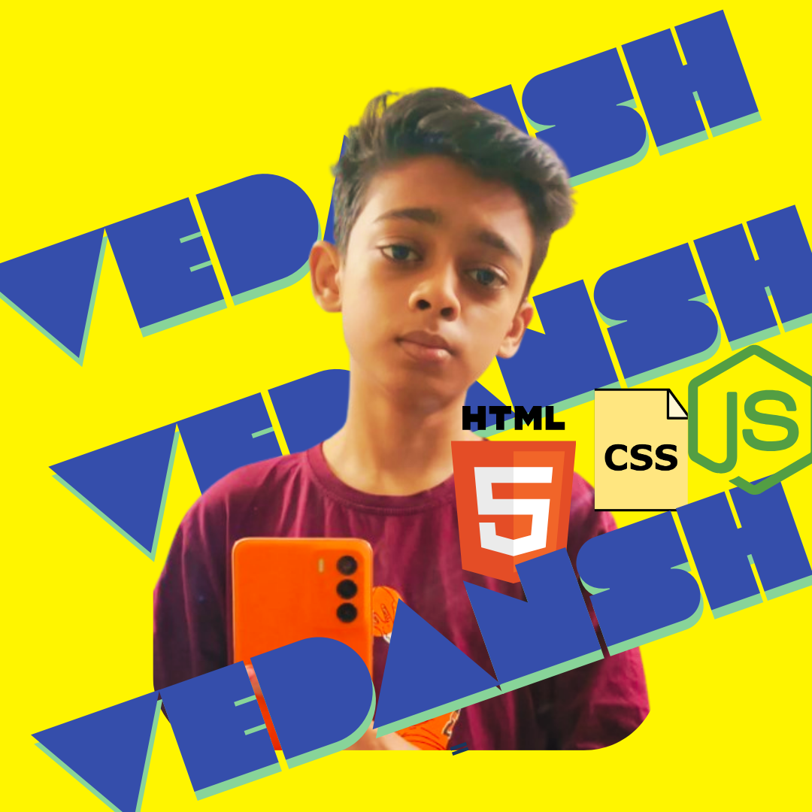

<h1 align="center">Hey 👋, It's Developer Vedansh</h1>
<h3 align="center">A passionate frontend developer from India with expertise in HTML, CSS, and JavaScript.</h3>

  
   
  

- 🔭 I’m currently working on **different projects**
- 📫 Reach me at **singhvedansh74@gmail.com**
- 🌱 I’m currently improving my skills in **JS and CSS**
- 💬 Ask me anything about **my projects on my portfolio**
- ⚡ Fun fact: [I think I am funny!!](#)
- 👨‍💻 All of my projects are available at **[devlopervedansh.netlify.app](https://devlopervedansh.netlify.app)**
- 📝 I regularly write articles on **coming soon!!**

---

### Blog posts
<!-- BLOG-POST-LIST:START -->
<!-- BLOG-POST-LIST:END -->

---

### Connect with me:

---

### Languages and Tools:

  
  
  
  
  
  
  

---

  

